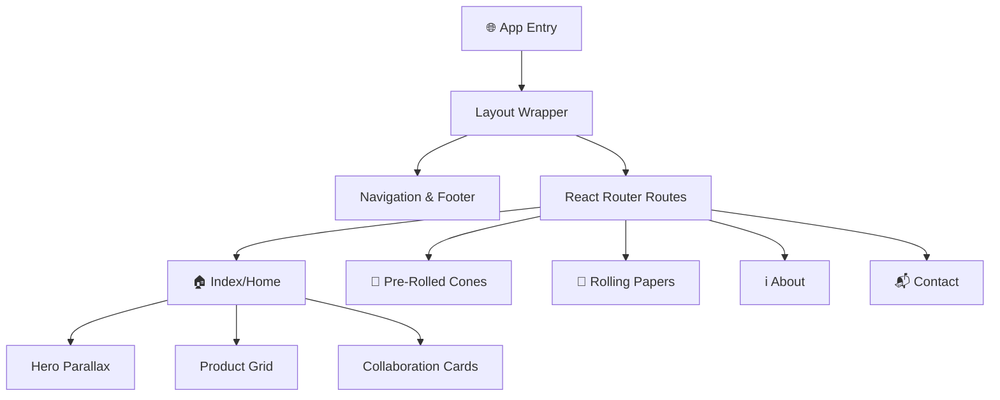

# 🌿 Kasol Rolls — Premium Brand Website

**Kasol Rolls** is a luxury digital experience built for a heritage rolling paper brand pioneering since 1991.
The platform showcases organic hemp pre-rolled cones and slow-burning rice & hemp blend rolling papers through an immersive, modern web interface.

---

## 🌿 About Kasol Rolls

Kasol Rolls is a premium rolling products brand known for its craftsmanship, authenticity, and urban soul.
The website reflects its legacy while delivering a contemporary, high-end user experience.

### 🧾 Product Lines

#### 🔸 Pre-Rolled Cones

Premium cones crafted from organic hemp, ensuring:

* Consistent burn
* Smooth draw
* Enhanced flavor preservation

#### 📜 Rolling Papers

High-quality rolling papers made from a rice & hemp blend:

* Slow-burning composition
* Natural gum adhesive
* Designed for purity and performance

#### 🎨 Custom Pre-Rolled Cones

Personalized cones tailored for:

* Events & promotions
* Brand collaborations
* Custom prints and packaging

---

## ✨ Website Features

| Feature                  | Description                                                        |
| ------------------------ | ------------------------------------------------------------------ |
| 🏠 Enhanced Hero         | Immersive hero section with parallax effects and storytelling      |
| 🛍️ Signature Collection | Interactive product grid with smooth hover animations              |
| 🤝 Collaboration Hub     | Dedicated sections for creatives & distributors                    |
| ℹ️ Brand Narrative       | Pages detailing heritage and craftsmanship                         |
| 📱 Responsive Design     | Mobile-first, fully responsive layouts                             |
| 🎞️ Smooth Experience    | Scroll animations and transitions powered by Framer Motion & Lenis |

---

## 🗺️ Site Architecture



---

## 🛠️ Tech Stack

* **Framework:** React 18 + TypeScript
* **Build Tool:** Vite 5
* **Styling:** Tailwind CSS, shadcn-ui, Lucide React
* **Animations:** Framer Motion, Lenis (smooth scrolling)
* **State Management:** TanStack Query (React Query)
* **Routing:** React Router DOM

---

## 📁 Project Structure

```plaintext
src/
├── assets/          # Brand imagery (hero, product visuals, branding)
├── components/      # Reusable UI components & layout
│   ├── ui/          # shadcn-ui primitives
│   └── Navigation.tsx
├── hooks/           # Custom hooks (useLenis, useMobile, etc.)
├── pages/           # Route views (Home, About, Contact, Products)
└── lib/             # Utility functions and styling helpers
```

---

## 🚀 Getting Started

### 1. Clone the Repository

```bash
git clone https://github.com/your-username/kasol-rolls.git
cd kasol-rolls
```

### 2. Install Dependencies

```bash
npm install
```

### 3. Run Development Server

```bash
npm run dev
```

### 4. Build for Production

```bash
npm run build
```

---

## 🎨 Design Philosophy

Kasol Rolls blends:

* 🌿 Natural authenticity
* 🏙️ Urban luxury
* 🎯 Product precision

The UI emphasizes:

* Minimalism with depth
* Smooth motion & tactile feedback
* Story-driven brand presentation

---

## 📜 License

This project is proprietary and developed for Kasol Rolls.
All rights reserved © 2026.

---

**Kasol Rolls — Crafted for the Perfect Ritual 🌿**
